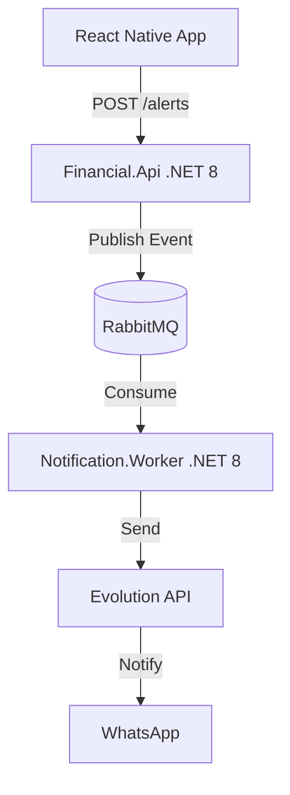

# 📈 Financial Alert System

An Event-Driven Architecture (EDA) project featuring real-time financial alerts and investment simulations.

[🇧🇷 Português](https://www.google.com/search?q=%23portugues) | [🇺🇸 English](https://www.google.com/search?q=%23english)

---

## 🏗 Architecture / Arquitetura

## 📸 Demo / Demonstração

| Feature / Funcionalidade | Preview |
| --- | --- |
| **WhatsApp Alerts** |  |
| **Investment Simulator** |  |

---

### 📱 Demonstração do Fluxo (Workflow Demo)

## 🇺🇸 English

### Overview

This project demonstrates a decoupled system using **.NET 8** and **RabbitMQ**. It handles high-throughput financial alerts and provides an investment simulation tool.

* **Backend**: .NET 8 (API + Worker Services)
* **Frontend**: React Native (Expo)
* **Messaging**: MassTransit with RabbitMQ
* **Integration**: Evolution API for WhatsApp notifications

[⬆ Back to top](https://www.google.com/search?q=%23-financial-alert-system)

---

## 🇧🇷 Português

### Visão Geral

Projeto de arquitetura orientada a eventos para processamento de alertas financeiros e simulação de investimentos. Sistema robusto com desacoplamento total entre requisições e processamento em segundo plano.

* **Backend**: .NET 8 (API + Worker Services)
* **Frontend**: React Native (Expo)
* **Mensageria**: MassTransit com RabbitMQ
* **Integração**: Evolution API para envio de mensagens via WhatsApp

[⬆ Voltar ao topo](https://www.google.com/search?q=%23-financial-alert-system)
